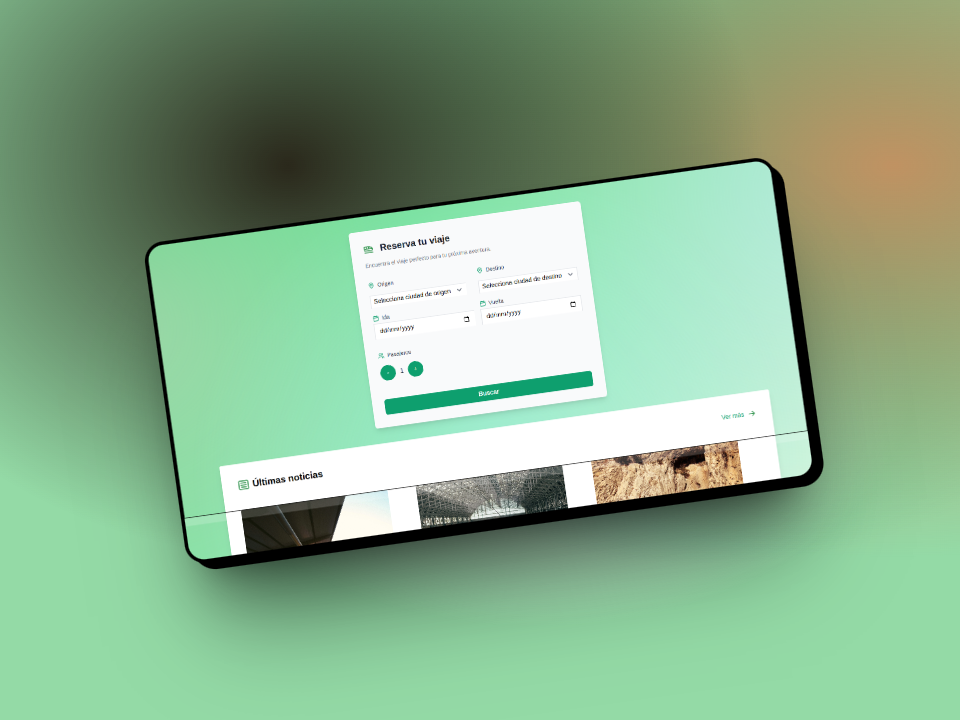

# Aplicacion-Gestion-Trenes-Tenfe
Aplicación web full stack realizada con React, NodeJS y MongoDB con la finalidad de realizar compras de trenes por distintos lugares de Europa y posteriormente poder visualizar los billetes comprados.

